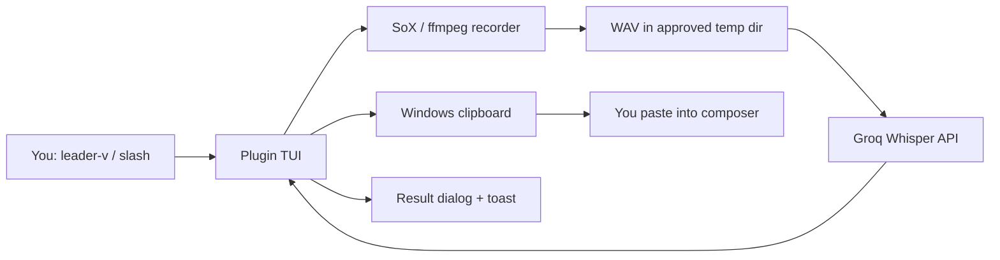

# Architecture

## Overview

`stt-opencode2` gives the OpenCode V2 TUI a voice on Windows. You tap
one hotkey to record from your mic, tap it again, and Groq Whisper
turns your speech into text. The text pops in a dialog and sits in
your clipboard. You paste it into the composer yourself. Alpha sends
nothing on your behalf.

## System Context

## Components

### `index.ts`, the server stub

The server loader needs a plugin object, so you give it the smallest
one that works: `{ id: "stt-opencode2-server", setup() {} }`. It
imports nothing at runtime, so the server resolves no `node_modules`.

### `tui.ts`, the state machine

This file owns the whole flow and all UI.

- It tracks the active recording, the auto-stop timer, and the
  language getter/setter in one `VoiceState`.
- It registers `keymap.layer` from the always-mounted `app` slot
  render. You call it at `setup` top level and the host throws
  `Keymap.Provider is missing`.
- It exposes two commands: `stt-voice.toggle` (`<leader>v`, `/voice`)
  and `stt-voice.lang` (`/voice-lang` opens a select dialog and
  persists your pick).
- For output it opens a large `dialog.alert` and follows with a
  success toast, or a warning toast when the copy fails. It fires an
  instant `Starting recording` toast on keypress because SoX needs
  a second to spawn. The old code toasted after spawn alone, so
  the toast looked lost.

### `lib/recorder.ts`, capture with fallback

SoX records first, ffmpeg covers when SoX cannot.

- SoX uses explicit `-t waveaudio 0`. Bare `sox -d` reports no default
  audio device on this machine, so you name device 0. A mic picker
  waits for Beta. Dead SoX leaves stderr behind. You read that.
- ffmpeg enumerates DirectShow devices and grabs the first. This path
  stays code-reviewed and untriggered while SoX stays healthy.
- A 120s timer stops long takes. The Groq free tier caps files at
  25MB, so the cap protects you.

### `lib/transcribe.ts`, upload with a locked model

One endpoint, one model, one key source.

- It posts to `https://api.groq.com/openai/v1/audio/transcriptions`
  with `whisper-large-v3-turbo`. No model option exists.
- It reads `GROQ_API_KEY` from your environment. It reads no file.
- `auto` skips the language param, `id` and `en` pass it through.
- `TranscribeError` turns missing-key, 401, 429, 413, and generic
  failures into toast text you understand.

### `lib/clipboard.ts`, exact copy

`clip.exe` copies stdin byte for byte with no trailing newline. A
round-trip probe proved the paste matches the source text. PowerShell
`Set-Clipboard` over base64 stands by as fallback. It keeps Unicode
but may normalize line endings, so it stays second choice.

## Data Flow

1. You press `<leader>v`. You see `Starting recording [lang X]…` at
   once.
2. SoX spawns. You see `Recording via sox…`. Your mic writes a WAV to
   `%LOCALAPPDATA%\Temp\opencode\stt-opencode2\`.
3. You press `<leader>v` again, or the 120s timer fires. You see
   `Recorded …, Transcribing via Groq…`.
4. The plugin transcribes with your stored language, copies the text,
   and opens the result dialog. You confirm. You get a success toast
   with the char count, or a warning when the copy failed.

## Decisions

### Groq-only, locked model

Alpha spends nothing. Groq grants a free tier that resets daily,
one endpoint covers the need, one model removes the choice. Deepgram
and local models wait for your explicit go-ahead.

### Dialog plus clipboard, no auto-submit

You review before you send. That rule stands through Alpha. The V2
typings (`@opencode/plugin@2.0.2`) publish no composer-insert path
(the `tui.prompt.append` event exists with nowhere to send it), so
the transcript leaves the dialog through your clipboard. That is the
one way out.

### Slot claims return elements or null

A sidebar footer claim returned a plain string once and crashed the
TUI on open. The server log recorded nothing. The crash lived in the
renderer alone. You now know the rule: slot render functions return
real elements or `null`. The sidebar language indicator waits for Beta
with a safe render pattern.

## Technology Stack

TypeScript, checked with `node --check`. No build step, no
`package.json`. The host loads sources straight from
`.opencode/plugins/stt-opencode2/`. Plugin API comes from
`@opencode/plugin` TUI `2.0.2` typings. SoX 14.4.2 captures, ffmpeg
covers, `clip.exe` copies, Groq transcribes.

## Limits You Accept

Windows only: paths, shells, clipboard. Keys live in your
environment. You read each failure in plain words: missing key, dead
mic, 401, 429, 413. The server log (`opencode.log`) covers loader
trouble. Renderer crashes print in your terminal and nowhere else.

## Beta Candidates

Mic picker, global install, composer-insert when the API lands,
settings UI, diagnostics screen. TTS, auto-submit, Deepgram, and local
models stay out until you say otherwise.
