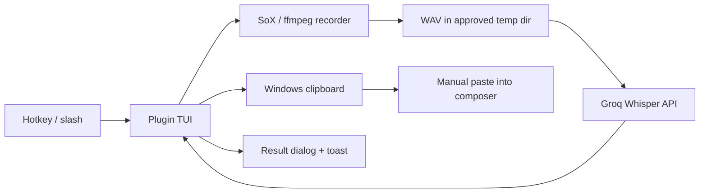

# Architecture

## Overview

`stt-opencode2` gives the OpenCode V2 TUI a voice on Windows. One
hotkey records from the mic, the same hotkey stops, Groq Whisper turns
speech into text. The text pops in a dialog and sits in the
clipboard. Paste it into the composer from there. Nothing sends on
its own through Alpha.

## System Context

## Components

### `index.ts`, the server stub

The server loader needs a plugin object, so this file hands it the
smallest one that works: `{ id: "stt-opencode2-server", setup() {} }`.
Zero runtime imports mean zero `node_modules` resolution on the
server side.

### `tui.ts`, the state machine

The whole flow plus all UI lives here.

- One `VoiceState` tracks the active recording, the auto-stop timer,
  and the language getter/setter.
- Registration of `keymap.layer` happens from the always-mounted `app`
  slot render. Top-level `setup` calls throw `Keymap.Provider is missing`.
- Two commands ship: `stt-voice.toggle` (`ctrl+x v`, `/voice`) and
  `stt-voice.lang` (`/voice-lang` opens a select dialog and persists
  the pick).
- Output opens a large `dialog.alert`, then a success toast, or a
  warning when the copy fails. An instant `Starting recording` toast
  fires on keypress. SoX needs a second to spawn, and the old code
  toasted only after that, so the toast looked lost.

### `lib/recorder.ts`, capture with fallback

Capture starts with SoX. ffmpeg covers the case SoX cannot handle.

- SoX uses explicit `-t waveaudio 0`. Bare `sox -d` reports no default
  audio device on this machine, hence device 0 by name. A mic picker
  waits for Beta. Dead SoX leaves stderr behind. Read that, not a bare
  ENOENT.
- ffmpeg enumerates DirectShow devices and grabs the first. This path
  stays code-reviewed and untriggered while SoX stays healthy.
- A 120s timer stops long takes. The Groq free tier caps files at
  25MB, so the cap protects the upload.

### `lib/transcribe.ts`, upload with a locked model

A single endpoint plus a locked model keeps this part small.

- Uploads hit `https://api.groq.com/openai/v1/audio/transcriptions`
  with `whisper-large-v3-turbo`. No model option exists.
- The key comes from `GROQ_API_KEY` in the environment. No file gets
  read.
- `auto` skips the language param, `id` and `en` pass it through.
- `TranscribeError` turns missing-key, 401, 429, 413, and generic
  failures into plain toast text.

### `lib/clipboard.ts`, exact copy

`clip.exe` copies stdin byte for byte with no trailing newline. A
round-trip probe proved paste matches source. PowerShell
`Set-Clipboard` over base64 stands by as fallback. The fallback keeps
Unicode but may normalize line endings, so it stays second choice.

## Data Flow

1. The first `ctrl+x v` brings an instant `Starting recording
   [lang X]…` toast.
2. SoX spawns, the `Recording via sox…` toast follows, the mic writes
   a WAV to `%LOCALAPPDATA%\Temp\opencode\stt-opencode2\`.
3. A second `ctrl+x v`, or the 120s timer, ends capture. The
   `Recorded …, Transcribing via Groq…` toast follows.
4. Transcription runs in the stored language, the text hits the
   clipboard, the result dialog opens. Confirmation brings a success
   toast with the char count, or a warning when the copy failed.

## Decisions

### Groq-only, locked model

Alpha spends nothing. Groq grants a free tier that resets daily, one
endpoint covers the need, one model removes the choice. Deepgram and
local models wait for an explicit go-ahead.

### Dialog plus clipboard, no auto-submit

Review precedes sending. That rule stands through Alpha. The V2
typings (`@opencode/plugin@2.0.2`) publish no composer-insert path
(the `tui.prompt.append` event exists with nowhere to send it), so
the transcript leaves the dialog through the clipboard. That is the
one way out.

### Slot claims return elements or null

A sidebar footer claim returned a plain string once and crashed the
TUI on open. The server log recorded nothing. The crash lived in the
renderer alone. Rule from that crash: slot render functions return
real elements or `null`. The sidebar language indicator waits for Beta
with a safe render pattern.

## Technology Stack

TypeScript, checked with `node --check`. No build step, no
`package.json`. The host loads sources from
`.opencode/plugins/stt-opencode2/`. The plugin API comes from
`@opencode/plugin` TUI `2.0.2` typings. SoX 14.4.2 captures, ffmpeg
covers, `clip.exe` copies, Groq transcribes.

## Limits in Force

Windows only: paths, shells, clipboard. Keys live in the environment.
Each failure reads in plain words: missing key, dead mic, 401, 429,
413. The server log (`opencode.log`) covers loader trouble. Renderer
crashes print in the terminal and nowhere else.

## Beta Candidates

Mic picker, global install, composer-insert when the API lands,
settings UI, diagnostics screen. TTS, auto-submit, Deepgram, and local
models stay out until someone says otherwise.
