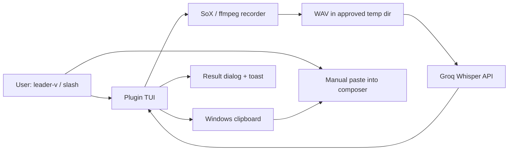

# Architecture

## Overview

`stt-opencode2` is a TUI-only speech-to-text plugin for OpenCode V2 on
Windows. One hotkey toggles microphone recording; stopping uploads the
WAV to Groq Whisper and shows the transcript in a dialog while copying
it to the clipboard. The user pastes manually into the composer —
there is no auto-submit in Alpha, by design.

## System Context

## Components

### `index.ts` — server stub

**Purpose**: satisfy the server-side plugin loader with zero dependencies.

Plain-object export (`{ id: "stt-opencode2-server", setup() {} }`), no
runtime imports, so the server needs no `node_modules` resolution.

### `tui.ts` — state machine + keymap

**Purpose**: own the record → transcribe → output flow and all UI.

- Toggle state machine (`VoiceState`: active recording, auto-stop
  timer, language getter/setter).
- `keymap.layer` registered from the always-mounted `app` slot render
  (calling it at `setup` top level throws `Keymap.Provider is missing`).
- Commands: `stt-voice.toggle` (`<leader>v`, `/voice`),
  `stt-voice.lang` (`/voice-lang` → `dialog.select`, persisted).
- Output: `dialog.alert` (large) + success/warning toast. Instant
  `Starting recording` toast fires on keypress because SoX spawn takes
  ~1s (previously the only toast came after spawn, looking "missing").

### `lib/recorder.ts`

**Purpose**: Windows audio capture with fallback.

- Primary: SoX with explicit `-t waveaudio 0` (bare `sox -d` fails on
  this machine: "no default audio device configured"; mic picker is a
  Beta item). Early-exit stderr is surfaced instead of a bare ENOENT.
- Fallback: ffmpeg via DirectShow device enumeration (code-reviewed;
  untriggered while SoX is healthy).
- Auto-stop timer: 120s (Groq free-tier 25MB file cap).

### `lib/transcribe.ts`

**Purpose**: Groq upload with locked model and human-readable errors.

- Endpoint `POST https://api.groq.com/openai/v1/audio/transcriptions`,
  model locked to `whisper-large-v3-turbo`, key from `GROQ_API_KEY`
  env only (never files).
- `language`: `auto` omits the param, `id`/`en` pass it through.
- `TranscribeError` maps missing-key / 401 / 429 / 413 / generic to
  user-readable toast text.

### `lib/clipboard.ts`

**Purpose**: exact-bytes clipboard copy on Windows.

- Primary `clip.exe` (copies stdin exactly, no trailing newline —
  verified byte-equal round-trip). Fallback: PowerShell
  `Set-Clipboard` via base64 (preserves Unicode, may normalize line
  endings, hence second choice).

## Data Flow

1. `<leader>v` → instant `Starting recording [lang X]…` toast.
2. SoX spawns → `Recording via sox…` toast; mic writes WAV to
   `%LOCALAPPDATA%\Temp\opencode\stt-opencode2\`.
3. Second `<leader>v` (or 120s timer) → stop → `Recorded …,
   Transcribing via Groq…` toast.
4. `transcribe()` with stored language → `copyToClipboard(text)` →
   `dialog.alert` with full text → success toast with char count
   (warning variant if copy failed).

## Key Design Decisions

### Groq-only, locked model

**Context**: Alpha must work with no paid key.
**Decision**: Groq free daily-reset tier, single endpoint, model fixed.
**Alternatives**: Deepgram, local whisper — deferred, need user
confirmation per scope lock.

### Dialog + clipboard, no auto-submit

**Context**: inserting text into the composer directly.
**Decision**: review-before-send is inviolable in Alpha; V2 typings
(`@opencode/plugin@2.0.2`) expose no composer-insert API
(`tui.prompt.append` event exists with no publish path).
**Consequence**: transcript never leaves the dialog except via clipboard.

### Raw-string slot renders crash the host

**Context**: a sidebar footer claim returning a plain string crashed
the TUI on open (renderer-side only — nothing in `opencode.log`).
**Decision**: reverted immediately; slot claims must return real
elements or `null`. Sidebar language indicator deferred to Beta with a
safe render pattern.

## Technology Stack

- **Language**: TypeScript (checked with `node --check`; no build step,
  no `package.json` — the host loads sources directly).
- **Plugin API**: `@opencode/plugin` TUI (`2.0.2` typings).
- **Capture**: SoX 14.4.2 primary, ffmpeg DirectShow fallback.
- **Clipboard**: `clip.exe`, PowerShell fallback.
- **Transcription**: Groq `whisper-large-v3-turbo`.

## Non-Functional Requirements

- **Platform**: Windows-first (paths, shells, clipboard).
- **Secrets**: env vars only; repo verified free of key material.
- **Reliability**: human-readable errors for every failure mode in
  `SPECS.md` (missing key, mic failure, 401/429/413).
- **Observability**: server log (`opencode.log`) for loader issues;
  TUI render crashes surface only in the terminal.

## Future Considerations (Beta candidates)

Mic picker, global install, composer-insert if the API lands, settings
UI, diagnostics screen. TTS / auto-submit / Deepgram / local models
stay out without explicit user confirmation.
